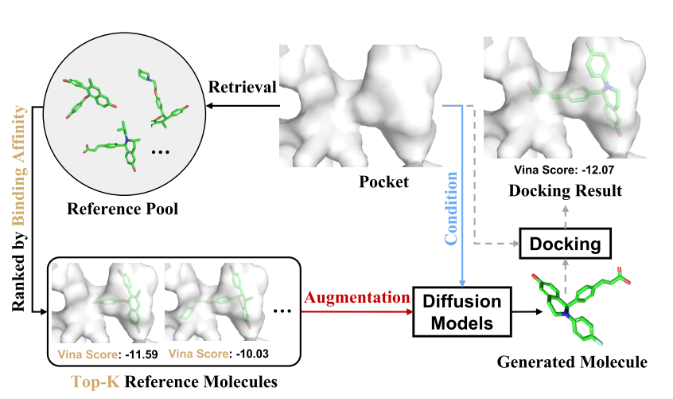

# 摘要
## 动机 Motivation
现有方法往往从零开始生成分子，未参考已有的配体结构，这在模型优化中带来困难，并可能导致生成效果欠佳。
## 方法特点
【1】几何蛋白-分子相互作用网络 geometric protein-molecule interaction network (PMINet)  
【2】检索与目标蛋白具有高结合亲和力的参考配体分子；retrieval augmentation  
【3】融合关键的蛋白-配体结合结构信息；self augmentation.

# 1背景
应对任务：structure-based drug design (SBDD)  
autoregressive models (ARMs) 容易受到误差累积的影响，且难以确定最优的生成顺序，这在三维分子图中尤为复杂。

> [1] Guan, J., Qian, W. W., Peng, X., Su, Y., Peng, J., and Ma, J. 3d equivariant diffusion for target-aware molecule generation and affinity prediction. In International Conference on Learning Representations, 2023a.  
[2] Schneuing, A., Du, Y., Harris, C., Jamasb, A., Igashov, I., Du,W., Blundell, T., Lió, P., Gomes, C., Welling, M., et al. Structure-based drug design with equivariant diffusion models. arXiv preprint arXiv:2210.13695, 2022.  
[3] Lin, H., Huang, Y., Liu, M., Li, X., Ji, S., and Li, S. Z. Diffbp: Generative diffusion of 3d molecules for target protein binding. arXiv preprint arXiv:2211.11214, 2022.

上面三个使用<mark style="background-color: #22B14C">扩散模型</mark>从标准高斯先验中建模原子类型与位置的分布，并通过<mark style="background-color: #ED1C24">后处理分配化学键</mark>。
他们基于 SE(3)-equivariant diffusion models (Hoogeboom et al., 2022)

> Hoogeboom, E., Satorras, V. G., Vignac, C., and Welling, M. Equivariant diffusion for molecule generation in 3d. In International Conference on Machine Learning, pp. 8867–8887. PMLR, 2022.

但作者认为从零生成对于满足生物指标（如结合亲和力）要求有难度。

本文提出 Interaction-based Retrieval-augmented Diffusion model (IRDIFF)。  
【1】引入了一小组对目标蛋白具有高结合亲和力的 target-aware 配体参考集；  
【2】蛋白-分子相互作用网络（PMINet），网络采用 SE(3)-等变机制与注意力机制；
【3】两种机制：(1) 检索与目标蛋白具有高结合亲和力的配体分子，作为参考结构；(2) 融合关键的蛋白-分子结合结构 (incorporate essential protein-molecule binding structures) ，以两种增强机制（检索增强与自增强）为条件，指导分子的扩散生成过程。

数据集 CrossDocked2020 dataset，achieves -6.03 Avg. Vina Score and 0.53 Avg. QED score。这两个指标不知道啥意思。

# 2Related Work

检索增强生成（Retrieval-Augmented Generation），利用少量参考示例对模型进行适应性调整。

他说他是第一次。

> our pioneering contribution is to discover proper protein-aware 3D molecule references for the purpose of addressing SBDD tasks, which is <mark style="background-color: #00A2E8">the first to</mark> incorporate complex cross-modal (protein-molecule) interactions in reference design, thereby introducing a new dimension to the field.

# 4Methods

方法流程：  
【1】用预训练 PMINet 检索结合参考分子。根据结合亲和力排序，然后抽取 蛋白-分子 相互作用 hints。
【2】反向扩散过程中，每一步，求参考分子的检索增强 + 生成的分子结构的自增强（加噪去噪过程中 target 蛋白不变），然后基于 检索增强+自增强+上一步的生成 继续去噪。

## 4.1用 PMINet 模拟蛋白质-配体相互作用

预训练 PMINet 基于 SE(3)-equivariant neural networks (Satorras et al., 2021) and cross-attention layers 在 蛋白质和配体分子 全连通图上建模二者之间的相互作用（为了预测亲和力）。

> Satorras, V. G., Hoogeboom, E., and Welling, M. E (n) equivariant graph neural networks. In International conference on machine learning, pp. 9323–9332. PMLR, 2021.

<mark style="background-color: #ED1C24">Q</mark>: 这个预训练也没说是什么任务，也没说为什么预训练之后就可以预测亲和力，是有精调过了吗？  
Please refer to Appendix B.1 for details.  
<mark style="background-color: #22B14C">A</mark>: 在训练过程中，我们使用预测结合亲和力分数与真实值之间的均方误差（MSE）作为优化目标。并且在结合亲和力预测任务中与 GraphDTA 比对，使用以下回归评估指标：均方根误差（RMSE）、平均绝对误差（MAE）、皮尔逊相关系数（R）和标准差（SD）。

## 4.2构建 Target-Aware 配体参考

利用 PMINet 先前学习到的基于结构的蛋白质-分子相互作用来识别最适合增强后续 Target-Aware 分子设计的候选分子（即具有高结合亲和力的分子配体）。

参考配体 可以 (1) 作为生成配体的子结构参考，也可以 (2) 揭示结合的关键位置。

并且生成过程中的上一个时间步生成的原子位置和类型也加入 reference pool。视为一种自增强。

## 4.3检索增强三维等变分子扩散

### 自增强
上一个时间步生成的原子位置和类型 + target 蛋白 一起输入到 PMINet 构成嵌入张量，表示自增强信息。 

more insights about self augmentation in Appendix A.

### 检索增强

用 PMINet 选择参考池中 结合亲和力 最高的 top-k 个候选配体，来生成张量。

参考配体的嵌入和上一个时间步生成的分子，做交叉注意力，生成的分子做 Q，配体的嵌入张量（通过 PMINet 输入配体和 target 蛋白后输出的张量作为配体的特征表示）做 K，V。

交叉注意力的输出作为检索增强的嵌入张量。

### 三维等变分子扩散生成（3D Equivariant Molecular Diffusion）

蛋白-配体复合物构建的 k 近邻图

SE(3)-等变神经网络

质心（Center of Mass, CoM）平移至原点，EGNN（等变图神经网络，Satorras 等, 2021），共同确保了反向生成核的 SE(3)-等变性。

对生成过程的增强仅涉及 SE(3)-不变隐藏状态的增强，不会破坏整个生成模型的 SE(3)-等变性。

# 5Experiments

## 5.0
### PMINet 预训练数据集：  
常用于结合亲和力预测任务的 PDBbind v2016 数据集
> Liu, Z., Li, Y., Han, L., Li, J., Liu, J., Zhao, Z., Nie, W., Liu, Y., and Wang, R. Pdb-wide collection of binding data: current status of the pdbbind database. Bioinformatics, 31(3):405–412, 2015.

### IRDIFF 模型，分子生成训练和评估数据集：  
CrossDocked2020 数据集
> Francoeur, P. G., Masuda, T., Sunseri, J., Jia, A., Iovanisci, R. B., Snyder, I., and Koes, D. R. Three-dimensional convolutional neural networks and a cross-docked data set for structure-based drug design. Journal ofChemical Information and Modeling, 60(9):4200–4215, 2020.

### Baseline Methods：  
Structure-Based Drug Design, SBDD）领域  
LiGAN（Ragoza 等，2022a）是一个条件变分自编码器（Conditional VAE）模型，基于蛋白-配体结构的原子密度栅格表示进行训练；
> Ragoza, M., Masuda, T., and Koes, D. R. Generating 3D
molecules conditional on receptor binding sites with deep
generative models. Chem Sci, 13:2701–2713, Feb 2022a.
doi: 10.1039/D1SC05976A.

AR（Luo 等，2021）和 Pocket2Mol（Peng 等，2022）是自回归（autoregressive）模型，依据蛋白质口袋结构和先前生成的原子，逐步生成三维分子原子；
> Luo, S., Guan, J., Ma, J., and Peng, J. A 3d generative model for structure-based drug design. Advances in Neural Information Processing Systems, 34:6229–6239, 2021.  
Peng, X., Luo, S., Guan, J., Xie, Q., Peng, J., and Ma, J.
Pocket2mol: Efficient molecular sampling based on 3d
protein pockets. arXiv preprint arXiv:2205.07249, 2022.

TargetDiff（Guan 等，2023a）和 DecomposeDiff（Guan 等，2023b）是目前最先进的非自回归扩散模型，用于结构基础药物设计。
> Guan, J., Qian, W. W., Peng, X., Su, Y., Peng, J., and Ma, J. 3d equivariant diffusion for target-aware molecule generation and affinity prediction. In International Conference on Learning Representations, 2023a.  
Guan, J., Zhou, X., Yang, Y., Bao, Y., Peng, J., Ma, J., Liu, Q., Wang, L., and Gu, Q. DecompDiff: Diffusion models with decomposed priors for structurebased drug design. In Krause, A., Brunskill, E., Cho, K., Engelhardt, B., Sabato, S., and Scarlett, J. (eds.), Proceedings of the 40th International Conference on Machine Learning, volume 202 of Proceedings of Machine Learning Research, pp. 11827–11846. PMLR, 23– 29 Jul 2023b. URL https://proceedings.mlr.press/v202/guan23a.html.

### 评估指标  
**molecular structures**  
计算生成分子与测试集中真实分子之间原子/键距离经验分布的  Jensen-Shannon 散度（JSD），以衡量两者在结构上的相似性。

**target binding affinity**  
采用 AutoDock Vina（Eberhardt 等，2021）来计算并报告多个与结合相关的指标的均值和中位数，这些指标包括：  
Vina Score：直接基于生成的三维分子估算结合亲和力；  
Vina Min：在估算前进行局部结构能量最小化；  
Vina Dock：包括一个额外的重新对接（re-docking）过程，反映最佳可能的结合亲和力；  
High Affinity：衡量每个测试蛋白中有多少生成分子的结合能力优于真实配体的比例。

**molecular properties**  
QED（Quantitative Estimation of Drug-likeness）：是对药物相似性的一种简单量化估计，结合了多个理想的分子性质；  
SA（Synthetic Accessibility）：衡量合成配体的难度；  
Diversity：计算所有生成配体之间的平均两两差异，用于反映分子的多样性。

## 5.1Main Results
在上面的指标上更好

## 5.2Model Analysis
自增强和检索增强消融  
检索数据库消融（参考分子亲和力越低让指标越差）