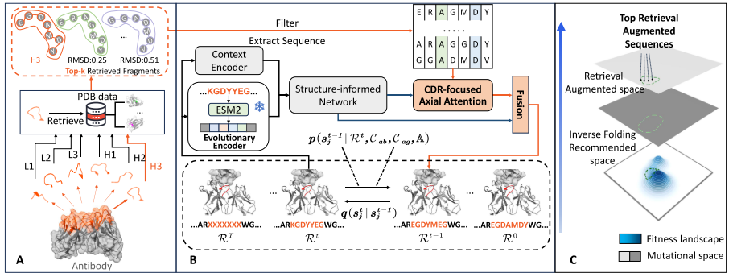

# 摘要
## 动机 motivations
现有方法主要是在无模板约束的情况下从头创建抗体，这导致了模型优化方面的挑战以及生成序列不自然的问题。
## 方法特点
【1】结构信息检索机制。通过双分支去噪模块，将这些示例基序与输入骨架相结合，同时利用结构和进化信息。
> a structure-informed retrieval mechanism that integrates these exemplar motifs with the input backbone through a novel dual-branch denoising module, utilizing both structural and evolutionary information.

【2】条件扩散模型，整合全局上下文和局部进化条件。
> conditional diffusion model that iteratively refines the optimization process by incorporating both global context and local evolutionary conditions

<mark style="background-color: #ED1C24">Q</mark>: IRDIFF 也用了 exemplar，他俩这词是否是一个意思？进化信息是哪来的？感觉进化信息应该是一个与 IRDIFF 的重大区别？

# 1背景
抗体是免疫系统中至关重要的 Y-shaped proteins。  
互补决定区（Complementarity Determining Regions, CDRs）  
设计有效的CDRs是开发强效治疗性抗体的核心。  

传统方法：  
【1】残基移植到现有结构上；  
【2】采样 alternative 天然 CDR loop 以增强亲和力；  
【3】使用 Rosetta 等工具对相互作用区域的序列设计进行优化。  

现有问题：  
【1】可用训练数据的多样性不足，主要依赖于 SAbDab 数据库，该数据库包含的抗原-抗体复合物结构不足一万个；  
【2】大多数现有方法试图从头设计抗体序列，缺乏基于模板的指导。（模板可以作为针对特定数据集进行微调的替代）  

方法特点：  
【1】利用蛋白质结构数据库，motif retrieval, and 半参数化 semi-parametric generative neural networks；  
【2】利用 template-aware 蛋白质局部&全局信息，提升生成能力；  
【3】整合 motif 进化信息来防止过拟合；  

Retrieval-Augmented Diffusion Antibody design model，RADAb

从非冗余 PDB 中构建 CDR-like 片段数据库。由于能够折叠成相似结构的蛋白质序列往往具有同源性并存在保守位点（进化信息）。对于有待优化的给定抗体，执行结构检索操作，获取与期望的 CDR 构架结构相似的基序。
> These CDR-like fragments are linear functional motifs structurally compatible with an antibody CDR loop, found in any protein geometry within the PDB.

采用一组结构同源的 CDR-like motif 与期望的骨架结构相结合，进行迭代序列优化。

# 2Related work

## 抗体设计
两条路径：传统能量函数优化（conventional energy function optimization）方法和机器学习方法。 

机器学习方法两个方向：   
（1）antibody sequence design and（2）antigen-specific antibody sequence-structure co-design.  

antibody sequence design：  
（1）language-based models；（2）inverse folding models

antigen-specific antibody sequence-structure co-design：  
将抗体-抗原复合物视为图结构，然后利用图网络提取特征，并预测抗体互补决定区（CDR）的坐标和残基类型

以上方法未参考模板。

## 扩散生成模型
small molecule generation (Wang et al., 2023b; Huang et al., 2024)
> [1] Zichao Wang, Weili Nie, Zhuoran Qiao, Chaowei Xiao, Richard Baraniuk, and Anima Anandkumar. Retrieval-based controllable molecule generation. In The Eleventh International Conference on Learning Representations, 2023b.  
[2] Zhilin Huang, Ling Yang, Xiangxin Zhou, Chujun Qin, Yijie Yu, Xiawu Zheng, Zikun Zhou,Wentao Zhang, Yu Wang, and Wenming Yang. Interaction-based retrieval-augmented diffusion models for protein-specific 3d molecule generation. In Forty-first International Conference on Machine Learning, 2024. (IRDIFF)

## 检索增强生成模型
引入外部数据库来增强语言模型。  
作者说本文是 **首个** 面向抗体设计的基于检索的生成框架。

# 3PRELIMINARIES AND NOTATIONS
抗体由两条重链和两条轻链构成，每条链的 tip 均有一个互补位点，该位点可特异性结合抗原上的独特抗原表位。此位点包含六个互补决定区（CDRs）：重链上的CDR-H1、CDR-H2和CDR-H3，以及轻链上的CDR-L1、CDR-L2和CDR-L3。

本框架的目标是从抗体骨架复合物中提取抗体 CDR 结构，将其输入检索模块以检索 CDR-like 片段，并最终根据 抗体骨架、抗原和 CDR-like 片段，预测待生成的 CDR 序列的氨基酸分布。

该工作使用 Diffab（Luo et al., 2022）作为生成模型的主干进行检索增强生成。
> Shitong Luo, Yufeng Su, Xingang Peng, Sheng Wang, Jian Peng, and Jianzhu Ma. Antigen-specific antibody design and optimization with diffusion-based generative models for protein structures. Advances in Neural Information Processing Systems, 35:9754–9767, 2022.

# 4方法

## 4.1CDR片段的结构检索 STRUCTURAL RETRIEVAL OF CDR FRAGMENTS

利用CDR结构在蛋白质数据库（PDB）中进行检索，旨在获取与真实CDR相似且具有同源序列的片段。  
采用MASTER工具（Zhou & Grigoryan，2015）进行搜索。在搜索过程中仅利用骨架原子位置信息（未泄露序列信息）。
> Jianfu Zhou and Gevorg Grigoryan. Rapid search for tertiary fragments reveals protein sequence–
structure relationships. Protein Science, 24(4):508–524, 2015.

与真实骨架结构的RMSD值作为评分标准进行排序。  
为方便使用，作者进一步构建了类CDR片段数据库（详见附录A.4）  

## 4.2模型架构
模型三个输入：(1) *antigen-antibody complex’s structure* and (2) *sequence context*, along with the (3) *sequences of the CDR-like fragments*, as conditional inputs to iteratively denoise.

模型两个分支：(1) 整体上下文信息 of the antigen-antibody complex；(2) cdr-like 片段的局部同源信息作为输入。

### 4.2.1全局几何上下文信息分支

#### 上下文编码器
单个残基的特征主要包括残基类型 (residue type)、主链骨架原子坐标 (residue type) 和主链骨架二面角 (residue type)。每对残基的特征主要包括两个残基的类型 (types of both residues)、序列相对位置 (types of both residues)、空间距离 (spatial distance) 和成对骨架二面体 (pairwise backbone dihedrals)。

这些信息 concatenated and then input 两个独立的 MLP。

#### 进化编码器
采用ESM2模型（Lin等人，2023）作为抗体序列编码器。
state of antibody sequence with CDR at timestep t 输入其中编码。

#### 基于结构的网络
上述编码结果作为条件输入，与当前时间步的CDR序列及结构状态共同输入至一组恒定点注意力（Invariant Point Attention, IPA）层 + MLP，得到每个CDR位点氨基酸类型的概率表示。

### 4.2.2局部 CDR 信息分支

#### CDR-like 片段的 post-processing

首先从抗体序列中移除 CDR 部分，得到抗体骨架序列。随后，将这些 CDR-like 片段填充至抗体骨架序列中，从而构建一个 CDR-like 序列矩阵。

#### CDR-focused 轴向 (Axial) 注意力机制

CDR-focused Axial Attention + MSATransformer  
行自注意力用于捕捉抗体-抗原序列内部的关联关系，而列自注意力则用于捕捉 CDR 残基与 CDR-like 残基之间的关联关系。

#### 用于信息融合的跳跃连接

即两个分支相加并 softmax，防止前向传播过程中，上一节的抗原-抗体上下文信息丢失。

## 4.3模型训练和推理
### 整体训练目标
CDR区域中每个残基处两种分布之间的KL散度（Kullback-Leibler Divergence）作为训练损失函数。
### 条件反向扩散过程
模型从时间步 T 开始，将抗体CDR区域的每个位点初始化为均匀分布。随后通过上述模型预测每个时间步的噪声分布。

# 5试验

用于训练模型的数据集来自SAbDab和作者建立的cdr-like的片段数据集。

## 5.1抗体CDR序列反折叠

将检索到的排名首位的类CDR片段直接移植到抗体骨架上，然后逆折叠，然后对比。

### Baselines
ProteinMPNN（Dauparas等人，2022）：一种利用消息传递神经网络，针对固定蛋白质骨架设计序列的模型；  
ESM-IF（Hsu等人，2022）：一种基于数百万预测结构训练的蛋白质逆向折叠模型；  
Diffab-fix（Luo等人，2022）：一种能够固定骨架结构，并利用扩散模型从序列空间中的纯噪声迭代生成候选序列的模型；  
AbMPNN（Dreyer等人，2023）：一种在抗体序列和结构上对ProteinMPNN进行微调的模型。由于该模型未开源，我们在其自有测试集上进行评估。

### 评估指标
【1】氨基酸恢复率（AAR，%）：指设计序列与真实CDR序列在相同位置上氨基酸相同的比例；  
【2】Self-consistency 均方根偏差（scRMSD，Å）：为计算scRMSD，我们使用ABodyBuilder2（Abanades等人，2023）对模型生成的抗体序列进行重新折叠。然后，将重新折叠的抗体骨架与原始抗体进行比对，并计算CDR区域Cα原子的均方根偏差；  
【3】合理性（Plausibility）：我们利用抗体语言模型AntiBERTy（Ruffolo等人，2021）中的伪对数似然值来计算生成序列的合理性。

## 5.2抗体功能优化

评估生成的抗体是否比原抗体有更好的功能性。

使用ABodyBuilder2将设计出的CDR-H3序列与骨架序列以及原始真实抗体序列折叠成完整的蛋白质结构。随后，利用PyRosetta（Alford等人，2017）中的FastRelax和InterfaceAnalyzer对结构进行弛豫处理，并计算抗体-抗原复合物的结合能∆G。

### 评估指标

∆∆G：该指标表示将设计后的CDR折叠入结构所形成的复合物与原始复合物之间的结合能差异。  
∆∆G-seq：该指标衡量将设计后的CDR序列折叠入结构所形成的复合物与将原始抗体序列折叠入结构所形成的复合物之间的结合能差异。其目的在于消除折叠工具引入的误差，以便直接比较序列的功能性。  
IMP-seq：该指标表示折叠入结构后，结合能低于（优于）原始抗体序列折叠后结合能的设计CDR序列所占的百分比。  

试验结果就是结合能降低，更好的结合亲和力。

## 5.3
### 消融实验

（1）验证检索增强模块的有效性；  
（2）评估检索所得数据的有效性；  
（3）评价进化嵌入的有效性。  

检索数据集的影响。  
