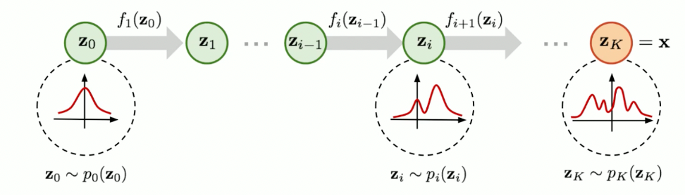

> [【AI知识分享】你一定能听懂的扩散模型Flow Matching流匹配基本原理深度解析
](https://www.bilibili.com/list/watchlater?oid=112692861864835&bvid=BV1Wv3xeNEds&spm_id_from=333.1007.top_right_bar_window_view_later.content.click)

# 1 前置知识

## 1.1 通量与散度

通量是单位时间内通过某个曲面的物理量
$$
\iint_\Sigma \vec{A} \cdot \vec{n} \ dS
$$
散度，可用于表征空间各点矢量场发散的强弱程度  
把三维体 $\Omega$ 压缩到 $M$ 点再除以三维体的体积 $V$ 就是散度。 
$$
div\vec{A}(M)=\lim_{\Omega \rightarrow M} \frac{1}{V} \oiint_\Sigma \vec{A} \cdot \vec{n} \ dS 
$$
在 [Flow Matching For Generative Modeling](https://arxiv.org/abs/2210.02747) 论文中，散度就是对每一个变量求偏导：
$$
div \mathbb{F} = \nabla \cdot \mathbb{F} = \frac{\partial \mathbb{F}}{\partial x} + \frac{\partial \mathbb{F}}{\partial y} + \frac{\partial \mathbb{F}}{\partial z} \\
div = \sum_{i=1}^d \frac{\partial}{\partial x^i}
$$

## 1.2 概率密度函数的变量变换
假设 $z$ 服从分布 $z\sim \pi(z)$，$x$ 服从 $x\sim p(x)$，存在函数 $f$，$x=f(z)$，$z=f^{-1}(x)$，则
$$
p(x) = \pi(z) \Big|\frac{dz}{dx}\Big| \\
= \pi(f^{-1}(x)) \Big|\frac{df^{-1}}{dx}\Big| \\
= \pi(f^{-1}(x)) \Big|(f^{-1})'(x)\Big|
$$
即 通过 $f$ 建立了随机变量间的关系，那就也可以得到随机变量的分布之间的关系。  

### 1.2.1 以 DDPM 为例

#### DDPM 的递推公式

**1. 前向过程定义**

前向过程通过$T$个时间步逐步对原始数据$X_0$添加噪声，最终得到$X_T \sim \mathcal{N}(0, I)$（标准高斯噪声）。每一步的加噪操作满足以下条件概率分布：
$$
q(X_t | X_{t-1}) = \mathcal{N}\left(X_t; \sqrt{1 - \beta_t} X_{t-1}, \beta_t I\right)
$$
其中：
- $\beta_t \in (0, 1)$ 是第$t$步的噪声强度（扩散系数），通常随时间步增大（如$\beta_1=0.0001$，$\beta_T=0.02$）。
- $\varepsilon_t \sim \mathcal{N}(0, I)$ 是标准高斯噪声。

**2. 递推公式展开**

通过递推展开，$X_t$可表示为$X_0$和所有中间噪声$\varepsilon_1, \varepsilon_2, \dots, \varepsilon_t$的线性组合：
$$
X_t = \sqrt{\alpha_t} X_{t-1} + \sqrt{1 - \alpha_t} \varepsilon_{t-1}
$$
其中$\alpha_t = 1 - \beta_t$。进一步展开至$X_0$：
$$
X_t = \sqrt{\alpha_t \alpha_{t-1}} X_{t-2} + \sqrt{\alpha_t (1 - \alpha_{t-1})} \varepsilon_{t-2} + \sqrt{1 - \alpha_t} \varepsilon_{t-1}
$$
重复此过程，最终得到：
$$
X_t = \sqrt{\overline{\alpha}_t} X_0 + \sqrt{1 - \overline{\alpha}_t} \varepsilon
$$
其中：
- $\overline{\alpha}_t = \prod_{s=1}^t \alpha_s = \prod_{s=1}^t (1 - \beta_s)$ 是累积噪声系数。
- $\varepsilon \sim \mathcal{N}(0, I)$ 是合并后的标准高斯噪声。

**3. 直接采样公式**

通过前向过程的定义，可直接从$X_0$采样$X_t$，无需逐步递推：
$$
q(X_t | X_0) = \mathcal{N}\left(X_t; \sqrt{\overline{\alpha}_t} X_0, (1 - \overline{\alpha}_t) I\right)
$$
即：
$$
X_t = \sqrt{\overline{\alpha}_t} X_0 + \sqrt{1 - \overline{\alpha}_t} \varepsilon
$$
**参数说明**：
- $\overline{\alpha}_t$ 控制$X_0$的保留程度，随$t$增大逐渐减小至$0$。
- $\sqrt{1 - \overline{\alpha}_t}$ 控制噪声的强度，随$t$增大逐渐增大至$1$。

#### DDPM 公式 概率密度函数的变量变换 例子

假设 $X_t=f(\varepsilon)$，$\varepsilon=f^{-1}(X_t)$ 可以通过概率密度函数的变量变换证明
$$
p(X_t) \sim N(\sqrt{\overline{\alpha}_t} X_0, (1 - \overline{\alpha}_t) I)
$$

根据概率密度函数的变量变换公式，我们逐步推导$p(X_t)$的分布：

**1. 明确变量关系**

- **定义映射**：$X_t = f(\varepsilon) = \sqrt{\overline{\alpha}_t} X_0 + \sqrt{1 - \overline{\alpha}_t} \varepsilon$  
  这是一个**线性变换**，可表示为$X_t = \mathbf{A}\varepsilon + \mathbf{b}$，其中：
  - $\mathbf{A} = \sqrt{1 - \overline{\alpha}_t} \cdot \mathbf{I}$（缩放矩阵）
  - $\mathbf{b} = \sqrt{\overline{\alpha}_t} X_0$（平移向量）

- **反函数映射**：$\varepsilon = f^{-1}(X_t) = \frac{X_t - \mathbf{b}}{\sqrt{1 - \overline{\alpha}_t}}$

**2. 应用变量变换公式**

概率密度变换公式为：
$$
p(x) = \pi(z) \left| \frac{dz}{dx} \right|
$$
其中$z = f^{-1}(x)$，$\pi(z)$是$z$的原始密度函数。

**步骤分解**：
1. **确定$z$和$\pi(z)$**  
   $z = \varepsilon \sim \mathcal{N}(0, \mathbf{I})$，因此$\pi(z) = \mathcal{N}(\varepsilon; 0, \mathbf{I})$，即：
   $$
   \pi(\varepsilon) = (2\pi)^{-n/2} \exp\left( -\frac{\|\varepsilon\|^2}{2} \right)
   $$

2. **计算雅可比行列式**  
   $\frac{dz}{dx} = \frac{d\varepsilon}{dX_t} = \left( \sqrt{1 - \overline{\alpha}_t} \right)^{-1} \mathbf{I} = \frac{1}{\sqrt{1 - \overline{\alpha}_t}} \mathbf{I}$  
   因此，绝对值为：
   $$
   \left| \frac{d\varepsilon}{dX_t} \right| = \left( \sqrt{1 - \overline{\alpha}_t} \right)^{-n} = (1 - \overline{\alpha}_t)^{-n/2}
   $$

3. **代入变换公式**  
   $$
   p(X_t) = \pi(\varepsilon) \cdot \left| \frac{d\varepsilon}{dX_t} \right| = \mathcal{N}(\varepsilon; 0, \mathbf{I}) \cdot (1 - \overline{\alpha}_t)^{-n/2}
   $$

**3. 推导最终分布**

将$\varepsilon = \frac{X_t - \sqrt{\overline{\alpha}_t} X_0}{\sqrt{1 - \overline{\alpha}_t}}$代入$\pi(\varepsilon)$：
$$
\begin{aligned}
p(X_t) &= (2\pi)^{-n/2} \exp\left( -\frac{\left\| \frac{X_t - \sqrt{\overline{\alpha}_t} X_0}{\sqrt{1 - \overline{\alpha}_t}} \right\|^2}{2} \right) \cdot (1 - \overline{\alpha}_t)^{-n/2} \\
&= (2\pi)^{-n/2} (1 - \overline{\alpha}_t)^{-n/2} \exp\left( -\frac{\|X_t - \sqrt{\overline{\alpha}_t} X_0\|^2}{2(1 - \overline{\alpha}_t)} \right) \\
&= \left[ (2\pi (1 - \overline{\alpha}_t))^{n/2} \right]^{-1} \exp\left( -\frac{\|X_t - \sqrt{\overline{\alpha}_t} X_0\|^2}{2(1 - \overline{\alpha}_t)} \right)
\end{aligned}
$$
这正是**多维高斯分布**$\mathcal{N}\left( \sqrt{\overline{\alpha}_t} X_0, (1 - \overline{\alpha}_t) \mathbf{I} \right)$的概率密度函数。

**4. 结论**

通过变量变换公式严格推导，得到：
$$
p(X_t) \sim \mathcal{N}\left( \sqrt{\overline{\alpha}_t} X_0, (1 - \overline{\alpha}_t) \mathbf{I} \right)
$$

**关键点说明**

- **线性变换的保高斯性**：线性变换$\mathbf{A}\varepsilon + \mathbf{b}$将标准高斯分布$\mathcal{N}(0, \mathbf{I})$映射为$\mathcal{N}(\mathbf{b}, \mathbf{A}\mathbf{A}^T)$。
- **雅可比行列式的作用**：补偿了变量变换导致的体积变化，确保概率密度积分归一化。
- **与DDPM前向过程的一致性**：该结果与DDPM中$X_t$的直接采样公式完全一致，验证了推导的正确性。

## 1.3 flow 的基本概念
将一个分布通过一系列的可逆变换变为另外一个分布的过程。

比如从 $N(0,I)$ 到 $P_{data}$。

这个 flow 过程相当于求 $X_t = (f_t \circ f_{t-1} \circ \cdots \circ f_{1})(X_0)$，  
其中聚合函数可以记作 $\phi_t = \psi_t = f_t \circ f_{t-1} \circ \cdots \circ f_{1}$。  
其中 $t \in [0,1]$ 连续。

### 1.3.1 continuous normalizing flows
对于这样的连续的 $t$，就可以把 flow 写成常微分方程 (Ordinary differential equation, ODE) 的形式
$$
\frac{d}{dt}\phi_t(x) = v_t(\phi_t(x)) \\
\phi_0(x) = x
$$
矢量 $v_t$ 表示，在 $t$ 时刻，对于概率密度函数 $p$ 或变换(flow) $\phi_t(x)$ 的移动方向与速度，不断通过这个向量场从 $X_0$ 变换到 $X_1$。$v_t$ 是 time-dependent vector field。

进一步，基于显式欧拉方法（Euler's Method），$X_{t+\Delta t}=X_t+\Delta t \cdot v_t$

此处，概率密度函数、概率密度路径 (probability density path) 是 $P_0 \leftrightarrow P_1$，对应的样本是 $X_0 \leftrightarrow X_1$。这里的 $X_0$ 是正态噪声，而 DDPM 里的 $X_T$ 是正态噪声。

### 1.3.2 push-forward Equation
对随机变量变换，也是对分布变换
$$
p_t=[\phi_t]*p_0=P_0(\phi_t^{-1}(x))\Big|(\phi_t^{-1})'(x)\Big|
$$

### 1.3.3 Continuity Equation
确保一个向量场 $v_t$ 可生成概率路径 $p_t$。
概率路径 $p_t$ 是概率密度，积分是1，各个 $t$ 下的概率路径都要满足这个条件。

$$
\frac{d}{dt}p_t(x)+\mathrm{div}(p_t(x)v_t(x))=0
$$

在物理学里，Continuity Equation是描述守恒量传输行为的偏微分方程。在适当条件下，质量、能量、动量、电荷等都是守恒量，因此很多传输行为都可以用连续性方程来描述。

> 以下来自 [深入解析Flow Matching技术](https://zhuanlan.zhihu.com/p/685921518)

连续性方程的一般形式是通过对流体的质量守恒定律进行数学推导得到的：

$$
\frac{\partial \rho}{\partial t} + \mathrm{div}(\rho v)=0
$$

* $\rho$ 是流体的密度。  
* $v$ 是流体的速度矢量。  
* $\frac{\partial \rho}{\partial t}$ 是密度随时间的变化率。  
* $\mathrm{div}(\rho v)$ 是质量通量密度的散度，表示单位时间内通过单位面积的净质量流量。  

这个方程表明，流体密度的时间变化率加上质量通量密度的散度等于零。换句话说，**流体中任何封闭体积内的质量变化率等于流入和流出该体积的质量流量的差**。

由于概率密度函数的性质确保了在全体分布上的积分为1，这反映了概率的总和是固定的，即概率是守恒的。在CNFs中，可以将这个性质与流体力学中的连续性方程类比，从而得到概率密度的连续性方程：

$$
\frac{\partial p_t(x)}{\partial t}+\mathrm{div}(p_t(x)v_t(x))=0
$$

其中，$p_t(x)$ 是 $t$ 时刻的概率密度函数，$v_t(x)$ 是与 $p_t(x)$ 相关联的向量场，它描述了概率密度随位置和时间的变化，$\mathrm{div}(p_t(x)v_t(x))$ 是向量场与概率密度的乘积的**散度**，表示概率流通过某个区域的净变化率。

性质：Continuity Equation是判断向量场 $v_t(x)$ 产生对应的概率密度路径 $p_t(x)$ 的充分必要条件。如果向量场 $v_t(x)$ 和概率密度路径 $p_t(x)$ 满足Continuity Equation，则在CNFs中该向量场 $v_t(x)$ 就能产生对应的概率密度路径 $p_t(x)$ 。

# 2 Flow matching - 三大问题对应三大定理

## 2.1 损失函数

类比 score matching 的损失函数，
$$
\mathcal{L}=\mathbb{E}_{\cdots}||S_\theta(x)-\nabla xlog(x)||^2
$$
Flow matching 的损失函数
$$
\mathcal{L}_{FM}(\theta)=\mathbb{E}_{t,p_t(x)}||v_t(x)-u_t(x)||^2
$$
其中 $v_t(x)$ 就是神经网络预测的向量场，$u_t(x)$ 就是 ground truth 真实值。

### 2.1.1 那么 真实值 $u_t(x)$ 是什么？怎么获取？

在 score matching 中，通过加噪得到已知的 $P(x'|x)$。

在 DDPM 中，如何知道 $P(X_{t-1}|X_t)$？通过加入训练输入原图 $X_0$，$P(X_{t-1}|X_t,X_0)$

那么在 flow matching 中，通过加入原图 $X_1$，$u_t(X|X_1)$。可否让模型预测 $u_t(X|X_1)$ 来学习向量场？

## 2.2 问题一：由条件向量场 $u_t(X|X_1)$ 加权平均得到的 $u_t(X)$ 能否和 $p_t(x)$ 形成一个合法的边缘流？

> ~~为什么用 $u_t(X|X_1)$ 作为预测目标可以代替原始公式中的 $u_t(X)$ ？~~

> Theorem 1. Given vector fields $u_t(x|x_1)$ that generate conditional probability path $p_t(x|x_1)$, for any distribution $q(x_1)$, the marginal vector field $u_t$ in equation 8 generates the marginal probability path $p_t$ in equation 6, i.e., $u_t$ and $p_t$ satisfy the continuity equation (equation 26).

> 定理 1. 已知 $u_t(x|x_1) \rightarrow p_t(x|x_1)$，证明 $u_t(x) \rightarrow p_t(x)$

已知

$$
p_t(x)=\int p_t(x|x_1)q(x_1)dx_1
$$

边缘概率路径 $p_t(x)$ 的本质是**对条件概率路径 $p_t(x|x_1)$ 的加权平均**，权重为初始样本的分布 $q(x_1)$。

证明：
$$
\frac{d}{dt}p_t(x)=\int \Big(\frac{d}{dt}p_t(x|x_1)\Big)q(x_1)dx_1 \\
=-\int \mathrm{div}\Big(u_t(x|x_1)p_t(x|x_1)\Big)q(x_1)dx_1 \\
=-\mathrm{div}\Big(\int u_t(x|x_1)p_t(x|x_1)q(x_1)dx_1 \Big)
$$

通过对条件向量场进行加权并边缘积分到边缘向量场：

$$
u_t(x) = \int u_t(x|x_1)\frac{p_t(x|x_1)}{p_t(x)}q(x_1)dx_1
$$

在数据点 $x$ 处的向量场 $u_t(x)$ 是通过对所有可能的初始条件 $x_1$ 的条件向量场 $u_t(x|x_1)$ 加权积分得到的，权重是由条件概率密度 $p_t(x|x_1)$ 和边缘概率密度 $p_t(x)$ 的比值和 $q(x_1)$ 决定的。  
这个公式十分重要，是连接条件向量场和边缘向量场的桥梁。  
代入所证等式，得到：

$$
\boxed{\frac{d}{dt}p_t(x)=-\mathrm{div}\Big(u_t(x)p_t(x)\Big)}
$$

至此，证明了边缘向量场 $u_t(x)$ 和概率路径 $p_t(x)$ 满足连续性方程。  

## 2.3 问题二：条件损失与边缘损失的等价性

    而对于本节最初的问题 “为什么用 $u_t(x|x_1)$ 作为预测目标可以代替原始公式中的 $u_t(x)$”，

> ~~该如何设计基于条件向量场的损失函数？~~

$$
\mathcal{L}_{FM}(\theta)=\mathbb{E}_{t,p_t(x)}|| v_t(x) - u_t(x) ||^2 \\
\mathcal{L}_{CFM}(\theta)=\mathbb{E}_{t,q(x_1),p_t(x|x_1)}|| v_t(x) - u_t(x|x_1) ||^2
$$

> Theorem 2. Assuming that $p_t(x) \gt 0$ for all $x \in \mathbb{R}^d$ and $t \in [0,1]$, *then, up to a constant independent of $\theta$, $\mathcal{L}_{CFM}$ and $\mathcal{L}_{FM}$ are equal. Hence, $\nabla_\theta \mathcal{L}_{FM}(\theta)=\nabla_\theta \mathcal{L}_{CFM}(\theta)$*.

我们人为构造一个“连接每个样本与其对应噪声”的路径：
$$
x_t=(1-t)x_0+tx_1
$$
其中：$x_0$ 来自先验（通常是噪声）；$x_1$ 来自真实数据分布；$x_t$ 是两者之间的线性插值。  
于是可以定义一个“条件概率路径”：$p_t(x|x_1)$
表示：给定目标样本 $x_1$，在时刻 $t$ 生成样本 $x_t$ 的分布。  
该路径对应的条件向量场为：$u_t(x|x_1)$  
这个条件场是可以解析计算的，因为路径形式是我们自己定义的（例如线性或高斯插值）。

而 边缘向量场 $u_t(x)$ 就是条件向量场 $u_t(x|x_1)$ 的期望。
因此在训练时，模型的期望损失：
$$
\mathcal{L}=\mathbb{E}_{x_1\sim q(x_1),x\sim p_t(x|x_1)} ||v_\theta(x,t)-u_t(x|x_1)||^2
$$
等价于全体分布上的：
$$
\mathbb{E}_{x\sim p_t(x)} ||v_\theta(x,t)-u_t(x)||^2
$$

两种期望（条件损失与边缘损失）在训练目标上等价 的完整推导，关键点是：两者对模型参数（即对 $v_\theta$）的优化目标等价，因为它们只相差一个与 $v_\theta$ 无关的常数项。

### 2.3.1 条件损失与边缘损失等价证明 from chatgpt

**求证：**
$$
\mathcal{L}_{cond}(\theta):=\mathbb{E}_{x_1\sim q(x_1)}\mathbb{E}_{x\sim p_t(x|x_1)} || v(x) - u(x|x_1) ||^2
$$
与
$$
\mathcal{L}_{marg}(\theta):=\mathbb{E}_{x\sim p_t(x)} || v(x) - u(x) ||^2
$$
在关于 $v$ 的优化上是等价的 (即两者相差与 $v$ 无关的常数)。

**证明：**

先把条件损失写成积分形式：
$$
\mathcal{L}_{cond}(\theta)=\int q(x_1) dx_1 \int p_t(x|x_1)\ || v(x) - u(x|x_1) ||^2 \ dx
$$
对被积函数做平方展开 (向量范数的展开)：
$$
\begin{align*}
|| v(x) - u(x|x_1) ||^2 &= || v(x) - u(x) ||^2 \\&+ 2\big(v(x)-u(x)\big)^\top \big(u(x)-u(x|x_1)\big) \\&+ || u(x) - u(x|x_1) ||^2
\end{align*}
$$
将其代回并对 $x_1$ 与 $x$ 积分：
$$
\begin{align*}
\mathcal{L}_{cond}(\theta) &= \int q(x_1) dx_1 \int p_t(x|x_1)\ || v(x) - u(x) ||^2  \ dx \\&+ 2\int q(x_1) dx_1 \int p_t(x|x_1)\ \big(v(x)-u(x)\big)^\top \big(u(x)-u(x|x_1)\big) \ dx \\&+ \int q(x_1) dx_1 \int p_t(x|x_1)\ || u(x) - u(x|x_1) ||^2 \ dx
\end{align*}
$$
注意第一项中对 $x_1$ 的积分只作用于 $p_t(x|x_1)$，因此可以把它合并成对边缘 $p_t(x)$ 的积分：
$$
\int q(x_1) p_t(x|x_1) \ dx_1 = p_t(x)
$$
于是第一项等于
$$
\int p_t(x)\ || v(x) - u(x) ||^2 \ dx = \mathcal{L}_{marg}(\theta)
$$
看第二项 (交叉项)。交换积分顺序并对 $x_1$ 积分，得
$$
2\int \Big[\big(v(x)-u(x)\big)^\top \Big( \int q(x_1)  p_t(x|x_1)\ \big(u(x)-u(x|x_1)\big)\ dx_1 \Big) \Big] \ dx \\
= 2\int \big(v(x)-u(x)\big)^\top \Big( p_t(x)u(x) - \int q(x_1) p_t(x|x_1) u(x|x_1)\ dx_1 \Big) \ dx 
$$
根据 $u(x)$ 的定义（边缘向量场由条件向量场加权平均得到）：
$$
u(x)=\frac{1}{p_t(x)} \int q(x_1) p_t(x|x_1) u(x|x_1)\ dx_1
$$
因此括号内为零，于是交叉项为 **零**。

于是得到
$$
\mathcal{L}_{cond}(\theta) = \mathcal{L}_{marg}(\theta) + \underbrace{\int q(x_1) dx_1 \int p_t(x|x_1)\ || u(x) - u(x|x_1) ||^2 \ dx}_{:=C}
$$
其中 $C$ 与模型输出 $v(x)$ 无关（仅由已知的真实条件向量场决定）。

**结论**

我们得到**关键等式**
$$
\boxed{\mathbb{E}_{x_1}\mathbb{E}_{x|x_1} || v(x) - u(x|x_1) ||^2 = \mathbb{E}_{x} || v(x) - u(x) ||^2 + C}
$$
其中常数 
$$
C=\mathbb{E}_{x_1}\mathbb{E}_{x|x_1} || u(x) - u(x|x_1) ||^2
$$ 
不依赖与 $v$。
因此，在以 $v$ 为优化变量的训练过程中（最小化均方损失）：
* 最小化条件损失 $\mathcal{L}_{cond}(\theta)$ 与最小化边缘损失  $\mathcal{L}_{marg}(\theta)$ 等价，因为两者的梯度对 $v$ 是相同的（常数项 $C$ 不影响梯度）。
* 因而通过采样 $x_1$ 并使模型去拟合 $u(x|x_1)$ 能使模型收敛到边缘真实向量场 $u(x)$。

### 2.3.2 条件损失与边缘损失等价证明二
对于
$$
\mathcal{L}_{FM}(\theta)=\mathbb{E}_{t,p_t(x)}|| v_t(x) - u_t(x) ||^2 \\
\mathcal{L}_{CFM}(\theta)=\mathbb{E}_{t,q(x_1),p_t(x|x_1)}|| v_t(x) - u_t(x|x_1) ||^2
$$
其中
$$
||v_t(x)-u_t(x)||^2=||v_t(x)||^2 - 2\langle v_t(x), u_t(x) \rangle + ||u_t(x)||^2 \\
||v_t(x)-u_t(x|x_1)||^2=||v_t(x)||^2 - 2\langle v_t(x), u_t(x|x_1) \rangle + ||u_t(x|x_1)||^2
$$

要证这两个等式的第一项和第二项分别相等：

第一项：

$$
\begin{align*}
\mathbb{E}_{p_t(x)}||v_t(x)||^2&=\int ||v_t(x)||^2 p_t(x)\ dx \\
&=\int ||v_t(x)||^2 \int p_t(x|x_1) q(x_1)\ dx_1\ dx \\
&=\mathbb{E}_{q(x_1),p_t(x|x_1)} ||v_t(x)||^2
\end{align*}
$$

第二项：

$$
\begin{align*}
\mathbb{E}_{p_t(x)} \langle v_t(x), u_t(x) \rangle &= \int \langle v_t(x), \frac{\int u_t(x|x_1)p_t(x|x_1)q(x_1)\ dx_1}{p_t(x)} \rangle p_t(x)\ dx \\
&=\int \langle v_t(x), \int u_t(x|x_1)p_t(x|x_1)q(x_1)\ dx_1 \rangle \ dx \\
&=\int \int \langle v_t(x), u_t(x|x_1) \rangle p_t(x|x_1)q(x_1)\ dx_1 \ dx \\
&=\mathbb{E}_{q(x_1),p_t(x|x_1)}\langle v_t(x), u_t(x|x_1) \rangle
\end{align*}
$$

第三项是与 $v_t$ 无关项，因此 $\mathcal{L}_{FM}(\theta)$ 和 $\mathcal{L}_{CFM}(\theta)$ 对模型参数产生的梯度是相同的，因此二者等价。

## 2.4 问题三：给定一个高斯条件路径 $p_t(x|x_1)$，那么生成这个路径的向量场 $u_t(x|x_1)$ 是什么形式？

> 目前仍不知道条件向量场 $u_t(x|x_1)$ 的具体表达形式是什么?

$$
p_t(x|x_1)=\mathcal{N}(x|\mu_t(x),\sigma_t(x_1)^2I), \\
\mathcal{L}_{CFM}(\theta)=\mathbb{E}_{t,q(x_1),p_t(x|x_1)}|| v_t(x) - u_t(x|x_1) ||^2, \\
\mathcal{\psi}_t(x)=\sigma_t(x_1)x + \mu_t(x_1)
$$

对于概率密度路径 $p_t(x|x_1)$，  
当 $t=0$ 时，$p_0 \sim \mathcal{N}(0,I)$，则 $\mu_0(x_1)=0,\ \sigma_0(x_1)=1$；  
当 $t=1$ 时，$p_1 \sim \mathcal{N}(x_1,\sigma^2)$，$\sigma$ 尽量小 (要尽量接近 $x_1$)，则 $\mu_1(x_1)=x_1,\ \sigma_1(x_1) \rightarrow min$

对于 flow $\mathcal{\psi}_t(x)$，  
令 $x = \varepsilon \sim \mathcal{N}(0,I)$，作为高斯噪声。

由 continuous normalizing flows，
$$
\frac{d\psi_t(x)}{dt} = u_t(x|x_1)
$$
$$
\frac{d\psi_t(x)}{dt} = \sigma_t'(x_1)x+\mu_t'(x)=u_t\big(\psi_t(x)|x_1\big)
$$
令
$$
\psi_t(x)=y
$$
则
$$
x = \psi_t^{-1}(y)
$$
而
$$
x = \frac{1}{\sigma_t(x_1)}\Big(\psi_t(x)-\mu_t(x_1)\Big)
$$
代入
$$
\begin{align*}
\frac{d\psi_t(x)}{dt} &= \frac{\sigma_t'(x_1)}{\sigma_t(x_1)}\Big(\psi_t(x)-\mu_t(x_1)\Big)+\mu_t'(x_1)=u_t\Big(\psi_t(x)|x_1\Big) \\
&= \frac{\sigma_t'(x_1)}{\sigma_t(x_1)}\Big(y-\mu_t(x_1)\Big)+\mu_t'(x_1)=u_t\Big(y|x_1\Big) \\
&\rightarrow \frac{\sigma_t'(x_1)}{\sigma_t(x_1)}\Big(x-\mu_t(x_1)\Big)+\mu_t'(x_1)=u_t\Big(x|x_1\Big)
\end{align*}
$$

得到定理三

> Theorem 3. Let $p_t(x|x_1)$ be a Gaussian probability path as in equation 10, and $\mathcal{\psi}_t$ its corresponding flow map as in equation 11. Then, the unique vector field that define $\mathcal{\psi}_t$ has the form:
>$$
u_t(x|x_1)=\frac{\sigma_t'(x_1)}{\sigma_t(x_1)}(x-\mu_t(x_1))+\mu_t'(x_1)
>$$
>Consequently, $u_t(x|x_1)$ generates the Gaussian path $p_t(x|x_1)$.

这个定理提供了 CFM 的关键实现要素：

1. 给定条件高斯噪声路径，就能解析计算出目标向量场 $u_t(x|x_1)$。
2. 因此可以对模型输出 $v_t(x)$ 计算监督损失 $|| v_t(x) - u_t(x|x_1) ||^2$。 
3. 从而实现 CFM 的训练。

它解决了 如何构造 ground-truth vector field 的问题，是实现 Flow Matching 在实践中可训练的基础。

### 2.4.1 构造条件向量场的显式解析解 from chatgpt

**设定**

条件高斯概率路径
$$
p_t(x|x_1)=\mathcal{N}(x|\mu_t(x),\sigma_t(x_1)^2I)
$$
对应的 (线性仿射) 流映射 $\psi_t$ 把初始噪声 $x_0=z\sim \mathcal{N}(0,I)$ 映射为 $x_t$：
$$
\psi_t(z|x_1)=\mu_t(x_1)+\sigma_t(x_1)z
$$

**第一步：写出逆映射**

由于 $\psi_t(\cdot;x_1)$ 是仿射且 $\sigma_t(x_1) \neq 0$，其逆映射为
$$
z=\psi_t^{-1}(x|x_1)=\frac{x-\mu_t(x_1)}{\sigma_t(x_1)}
$$

**第二步：向量场与流映射的关系**

流映射与向量场的关系是 (对任意固定初始点 $z$)：
$$
\frac{d\psi_t(z|x_1)}{dt} = u_t\Big(\psi_t(z|x_1)|x_1\Big)
$$
因此对任意 $x$ (落在流像上) 有
$$
\boxed{u_t(x|x_1)=\frac{d\psi_t\Big(\psi_t^{-1}(x|x_1)|x_1\Big)}{dt}}
$$
这是从流映射导出向量场的标准公式。

**第三步：计算 $\frac{\psi_t(z|x_1)}{dt}$**

对 $\psi_t(z|x_1)=\mu_t(x_1)+\sigma_t(x_1)z$, 关于 $t$ 求导：
$$
\frac{d\psi_t(z|x_1)}{dt}=\frac{\mu_t(x_1)}{dt} + \frac{\sigma_t(x_1)}{dt}\cdot z=\mu_t'(x_1)+\sigma_t'(x_1)z
$$

**第四步：代回并消去 $z$**

把 $z=\psi_t^{-1}(x|x_1)=\frac{x-\mu_t(x_1)}{\sigma_t(x_1)}$ 代入上式：
$$
u_t(x|x_1)=\mu_t'(x_1)+\sigma_t'(x_1) \cdot \frac{x-\mu_t(x_1)}{\sigma_t(x_1)}
$$
这就是题中给出的解析形式：
$$
\boxed{u_t(x|x_1)=\frac{\sigma_t'(x_1)}{\sigma_t(x_1)}(x-\mu_t(x_1))+\mu_t'(x_1)}
$$

**第五步：为什么这个解析解生成的是 Gaussian 路径**

若 $z\sim \mathcal{N}(0,I)$，则
$$
x_t=\psi_t(z|x_1)=\mu_t(x_1)+\sigma_t(x_1)z \sim \mathcal{N}(u_t(x_1),\ \sigma_t(x_1)^2I)
$$
所以按 push-forward 定义，$\psi_t$ 将初始分布 $p_0=\mathcal{N}(0,I)$ 推为 $p_t(\cdot|x_1)$。  
由流-向量场的关系 $\frac{d\psi_t(z)}{dt}=u_t(\psi_t(z))$ 可见，上面构造的 $u_t$ 恰好是产生该流映射的向量场，因此它生成了对应的高斯条件路径。

**唯一性说明 (简要)**

给定可逆流映射 $\psi_t$，向量场 $u_t$ 在 $Im(\psi_t)$ 上由关系
$$
u_t(\psi_t(z))=\frac{d\psi_t(z)}{dt}
$$
唯一确定，因此上述解析表达式在流的定义域内是唯一的。

# 3 高斯条件概率路径的特殊形式

$$
p_t(x|x_1)=\mathcal{N}(x|\mu_t(x),\sigma_t(x_1)^2I), \\
\mathcal{\psi}_t(x)=\sigma_t(x_1)x + \mu_t(x_1), \\
u_t(x|x_1)=\frac{\sigma_t'(x_1)}{\sigma_t(x_1)}(x-\mu_t(x_1))+\mu_t'(x_1)
$$

**3.1 Variance Exploding path**
> score matching
>$$
p_t(x)=\mathcal{N}(x|x_1,\sigma_{1-t}^2I)
>$$
> 当 $t=0$ 时, $\sigma \gg 1$，所以称为 variance exploding。

令 $\mu_t(x_1)=x_1$，$\sigma_t(x_1)=\sigma_{1-t}$，可以发现 score matching 是 flow matching 的一个特例。

**3.2 Variance Preserving path**

> DDPM
>$$
>p_t(x|x_1)=\mathcal{N}(x|\alpha_{1-t}x_1,(1-\alpha_{1-t}^2)I) \\
>x_t=\sqrt{\overline{\alpha_t}}x_0 + \sqrt{1-\overline{\alpha_t}}\varepsilon
>$$

令 $\mu_t(x_1)=\alpha_{1-t}x_1$, $\sigma_t(x_1)=\sqrt{(1-\alpha_{1-t}^2)}$，可以发现 DDPM 是 flow matching 的一个特例。

**3.3 最优传输条件 flow matching**

$\mu_t(x)=tx_1$, and $\sigma_t(x)=1-(1-\sigma_{min})t$

当 $\sigma_{min}=0$ 时，  
$$
\psi_t(x)=(1-t)x+tx_1=x_t
$$
其中 $x\sim \mathcal{N}(0,I)$，此时从 $x_0$ 到 $x_1$ 的路径是一条直线。

